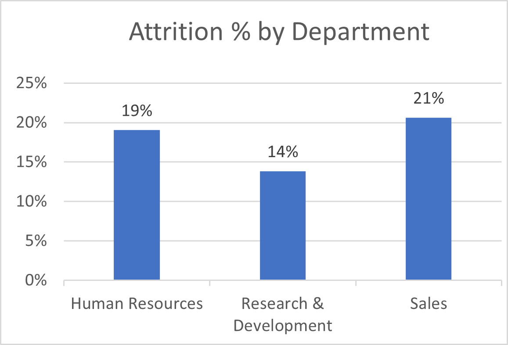

# HR Employee Attrition — Excel Analytics Project

A professionally documented **Excel-based** analysis of employee attrition using the IBM HR Analytics dataset.  
This repository includes a reproducible Excel workbook, clearly defined KPIs, and an executive-ready dashboard with insights for retention strategy.

> **Tech stack:** Microsoft Excel (Power Query, Pivot Tables, Pivot Charts, Slicers, Formulas)  
> **Owner:** Pooja Patel • **Use case:** Portfolio-quality data analytics project

---

## 🗂️ Dataset & Source

- **Source:** Kaggle — IBM HR Analytics Attrition dataset  
  https://www.kaggle.com/datasets/pavansubhasht/ibm-hr-analytics-attrition-dataset
- **Use in this repo:** The Kaggle dataset is imported into Excel and used as the base table for all pivots, KPIs, and the dashboard. Added lightweight cleaning and feature engineering (see `docs/Process_and_Design.md`).
- **Engineered fields:** `AgeGroup`, `IncomeGroup`, `CommuteRange`, `CareerStage`, `EmploymentStage`, `SatisfactionIndex` → `SatisfactionLevel`, `RecentPromotion`, `PromotionBand`, `ManagerStability`, `RiskScore`, `RiskTier`.
- **Attribution:** Credit to the original dataset contributors on Kaggle (for licensing of the dataset itself, refer to the Kaggle page).

---

## 📦 Repository Structure

```
.
├─ data/
│  └─ HR_Employee_Attrition_Data.xlsx     # Final Excel with KPIs, pivots, dashboard
├─ docs/
│  ├─ CaseStudy.md                    # Business questions → analysis → insights
│  ├─ KPI_Definitions.md              # KPI formulas, segmentation logic
│  ├─ DataDictionary.md               # Column meanings & example values
│  └─ Process_and_Design.md           # Cleaning steps, modeling, Excel design
├─ images/                            # Exported PNGs from the Excel dashboard/charts
│  ├─ dashboard.png
│  ├─ attrition_by_department.png
│  ├─ overtime_x_department.png
│  └─ ...
└─ README.md
```

---

## 🎯 Business Questions

1. **What is the overall attrition level?** Which **departments** and **job roles** are most impacted?
2. **Does OverTime correlate with higher attrition?** In which departments is the overlap most severe?
3. **How does attrition vary by talent lifecycle?** (**Career/Employment Stage** and **Age Group**)
4. **Do pay and commute relate to attrition risk?** (**Income Group** and **Commute Range**)
5. **What people-experience signals matter?** (**Satisfaction Level**, **Manager Stability**, **Recent Promotion**)
6. **What’s the economic impact of attrition?** (**Attrition cost** and **replacement exposure**)

---

## 🔑 Key Results (from `data/HR-Employee-Attrition-Data.xlsx`)

- **Workforce size:** **1470** employees
- **Attritions:** **237** employees → **16.1%** overall attrition rate

**Operational drivers**

- **OverTime:** _Yes_ employees attrite at **30.5%** vs **10.4%** for _No_.
- **Department:** Highest attrition rate in **Sales (20.6%)**; lowest in **Research & Development (13.8%)**.
- **Job Role:** Highest attrition rate in **Sales Representative (39.8%)**.

**Talent lifecycle**

- **Career Stage:** Highest attrition in **Early Career (38.2%)**.
- **Employment Stage:** **New Hires (34.9%)** are most at risk.
- **Age Group:** **<25 (39.2%)** shows the highest attrition.

**Reward & commute**

- **Income Group:** Highest attrition in **Low Income (21.8%)**; lowest in **High Income (3.8%)**.
- **Commute Range:** **20+ km** is most at risk (**22.1%**).

**People experience**

- **Satisfaction:** Attrition drops from **36.7%** at _Very Low_ to **10.2%** at _Very High_.
- **Manager Stability:** **Unstable** teams show **32.3%** vs **Stable** **12.6%**.
- **Recent Promotion:** **Promoted** **17.0%** vs **Not Promoted** **14.7%** (no strong protective effect).

**Economic impact**

- **Total attrition cost:** **$4,084,348**
- **Replacement cost exposure (attrited roles):** **$4,084,348**
- **Avg. replacement cost per attrition:** **$17,234**
- **Financial hotspots:** **R&D** shows the largest replacement exposure among attrited roles (≈ **$1,966,946**); top role is **Sales Executive** (≈ **$1,536,743**).

**Risk & Prioritization**

- **Risk tiers:** Attrition rises sharply by risk—**Q4 (Highest)** ≈ **44.1%** vs **Q1 (Lowest)** ≈ **5.1%**.

> See **docs/CaseStudy.md** for segment-level details and recommended actions.

---

## 📊 Dashboard (Highlights)


**Workforce & Cost**


**Core Drivers**



**Lifecycle & Experience**


**Economic Impact**


> More visuals and deep dives: see **docs/CaseStudy.md** (Income Group, Commute Range, Employment/Career stages, Manager Stability, Recent Promotion, Risk tiers, Department cost).

---

## 🔁 How to Use / Refresh

1. Open `data/HR-Employee-Attrition-Data.xlsx` in Excel.
2. Review the **kpis**, **analysis**, **charts**, and **dashboard** sheets.
3. Use the slicers on the Dashboard to interactively filter segments.
4. To update with new data: replace/append rows in the base table on **`attrition_data`** (same schema), then **Refresh All** so pivots/charts recompute.

---

## 📚 Documentation

- **CaseStudy:** Business questions → analysis → insights → actions → ROI
- **KPI Definitions:** Exact formulas used to compute all metrics
- **Data Dictionary:** Column descriptions and sample values
- **Process & Design:** Cleaning, feature engineering (AgeGroup, IncomeGroup, etc.), and Excel design choices

---

## 📝 License

MIT License
